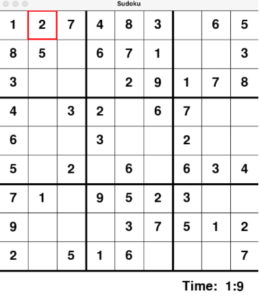
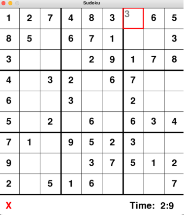
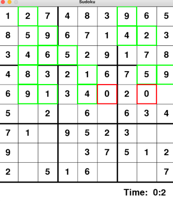
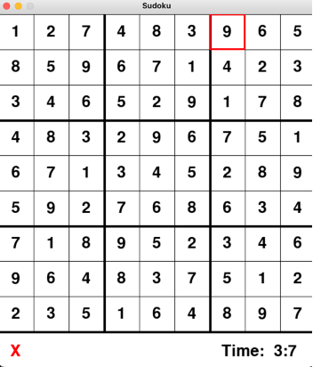

# Sudoku Solver

As a user, you may enter numbers. The red square highlights which square you are changing or adding the number to. Correct numbers will be confirmed with a black integer (left), and incorrect numbers will add an X to the bottom of the interface (right). There is also a timer keeping track of the total time spent.

The other feature is that you can solve the board entirely efficiently. The following solved board is on the right, and it displays the solving process as well (on the left). The solver uses a backtracking algorithm where red 0’s denotes that it is currently backtracking.

It follows that any valid sudoku board can be solved.